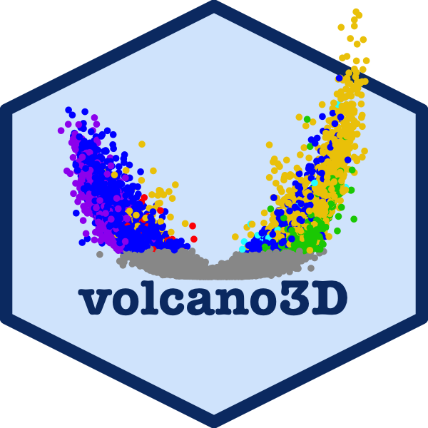

```{r setup, include = FALSE, echo = FALSE}
knitr::opts_chunk$set(echo = TRUE, 
                      warning = FALSE, 
                      message = FALSE, 
                      fig.height = 7, 
                      fig.width=7, 
                      fig.align = "center")
library(knitr)
library(kableExtra)
```


[](https://www.tidyverse.org/lifecycle/#experimental)


# volcano3Ddata 

The volcano3Ddata package provides the data to run examples in the 
[volcano3D package](https://github.com/KatrionaGoldmann/volcano3D). This
enables exploration of probes differentially 
expressed between three groups. Its main purpose is for the
visualisation of differentially expressed genes in a three-dimensional
volcano plot. These plots can be converted to interactive visualisations using
plotly. 

These examples explore a case study from the PEAC 
rheumatoid arthritis trial (Pathobiology of Early Arthritis Cohort). 
The methodology has been published in 
'Lewis, Myles J., et al. "Molecular portraits of early rheumatoid arthritis 
identify clinical and treatment response phenotypes." Cell reports 28.9 (2019): 
2455-2470.' 
([DOI: 10.1016/j.celrep.2019.07.091](https://doi.org/10.1016/j.celrep.2019.07.091))
with an interactive web tool available at 
[https://peac.hpc.qmul.ac.uk](https://peac.hpc.qmul.ac.uk).  

This tool acts as a searchable interface to examine relationships between 
individual synovial and blood gene transcript levels and histological, clinical, 
and radiographic parameters, and clinical response at 6 months. 
An interactive interface allows the gene module analysis to be explored for 
relationships between modules and clinical parameters. 
The PEAC interactive web tool was creating as an 
[R Shiny app](https://shiny.rstudio.com) and deployed to the web using a server. 


# Installation

*Not yet publicly available:*

```{r, eval = FALSE}
library(devtools)
install_github("KatrionaGoldmann/volcano3Ddata")

library(volcano3Ddata)
```

# Citation

volcano3D was developed by the bioinforamtics team at the 
[Experimental Medicine & Rheumatology department](https://www.qmul.ac.uk/whri/emr/) 
and [Centre for Translational Bioinformatics](https://www.qmul.ac.uk/c4tb/) at 
Queen Mary University London. 

If you use this package please cite as: 

> Lewis, Myles J., et al. "Molecular portraits of early rheumatoid arthritis 
identify clinical and treatment response phenotypes." Cell reports 28.9 (2019): 
2455-2470.

or using:

```{r}
citation("volcano3Ddata")
```

